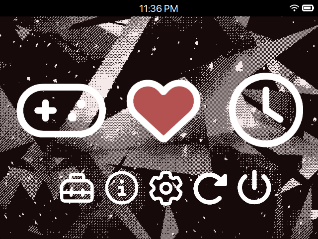
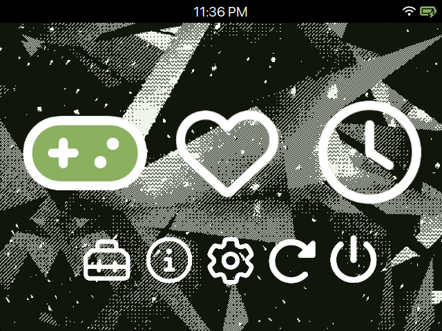
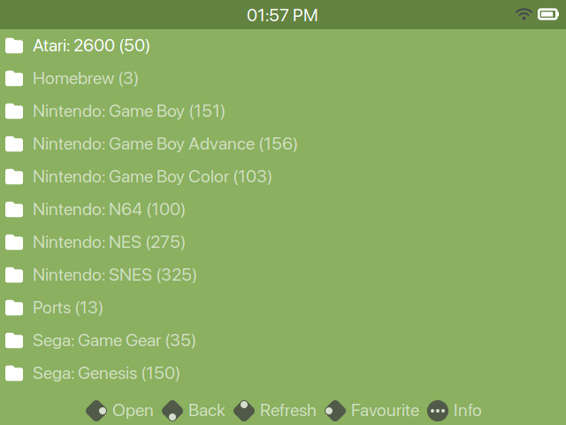

# CC-29

Inspired by MinUIfied and borrowing some glyphs from the Material Like theme, CC-29 aims to be colorful and easy to use. 

## Credits

- Based on [Alpha6's CC-29 Palette](https://lospec.com/palette-list/cc-29)
- Launcher wallpaper provided by [roboxel's glitchybgs asset pack](https://roboxel.itch.io/glitchybgs)
- List view and font provided by [hmcneill46's MinUfied theme](https://github.com/hmcneill46/muOS-MinUIfied-Theme-Generator)
- Button Icons provided by [gabrielfvale's material-like theme](https://github.com/gabrielfvale/muOS-material-like)
- Launcher and battery icons provided by [Font Awesome](https://fontawesome.com/)

## Changelog

### v1.0

- Initial Release
